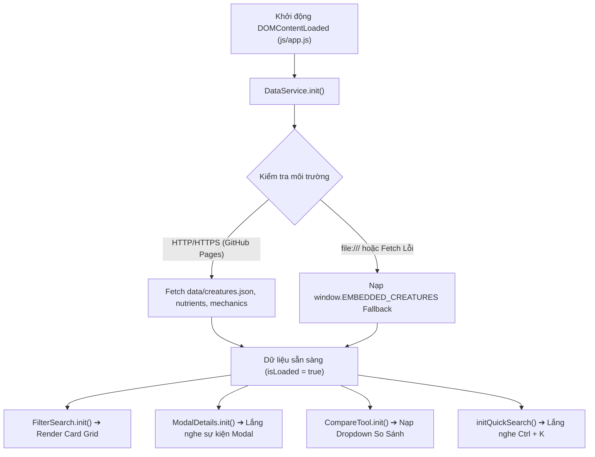

# 🏛️ Kiến Trúc Hệ Thống (Technical Architecture) - The Isle Wiki

Tài liệu này mô tả chi tiết kiến trúc kỹ thuật, luồng dữ liệu, các mô-đun JavaScript và công thức tính toán toán học được sử dụng trong dự án **The Isle Wiki (Evrima)**.

---

## 1. Triết Lý Thiết Kế (Design Philosophy)

- **Zero-Dependency Vanilla Web**: Không sử dụng bất kỳ thư viện hay framework bên ngoài nào (React, Vue, Webpack, Babel). 100% mã nguồn là HTML5 semantic, Modern CSS (CSS Custom Properties, Glassmorphism, Grid/Flexbox) và Vanilla JavaScript ES6+.
- **Instant Client-Side Computation**: Toàn bộ thuật toán tính toán tăng trưởng (Growth Slider 0%–100%) và so sánh kèo đấu (Matchup Comparison) chạy hoàn toàn trên trình duyệt người dùng với độ trễ bằng 0ms.
- **Dual-Data Loading Resilience**: Hỗ trợ nạp dữ liệu bất đồng bộ qua `fetch('./data/creatures.json')` trên môi trường web server (`http/https`) và tự động fallback sang `js/embedded-data.js` khi người dùng mở trực tiếp qua giao thức tệp (`file:///index.html`).

---

## 2. Sơ Đồ Luồng Hoạt Động (Data & Component Lifecycle)

---

## 3. Các Mô-đun JavaScript Cốt Lõi (Core Modules)

### A. `DataService` ([`js/data-service.js`](file:///c:/Users/meth/Desktop/the-isle-wiki/js/data-service.js))
- Quản lý nạp và lưu trữ bộ nhớ đệm (Cache) cho 3 tệp dữ liệu: `creatures.json`, `nutrients.json`, `mechanics.json`.
- Cung cấp các phương thức truy xuất dữ liệu: `getAllCreatures()`, `getCreatureById(id)`, `getNutrients()`, `getMechanics()`.

### B. `GrowthCalc` ([`js/growth-calc.js`](file:///c:/Users/meth/Desktop/the-isle-wiki/js/growth-calc.js))
Mô-đun thực hiện các phép nội suy toán học phi tuyến tính mô phỏng sự tích lũy khối lượng và phát triển thể chất của khủng long theo phần trăm tăng trưởng $g \in [0, 100]$:

1. **Công Thức Trọng Lượng (Exponential Mass Accumulation)**:
   $$W(g) = W_{min} + (W_{max} - W_{min}) \cdot \left(\frac{g}{100}\right)^{2.2}$$
   *Ý nghĩa*: Ở giai đoạn con non đến thiếu niên, trọng lượng tăng từ từ; khi đạt giai đoạn sub-adult và adult, khối lượng tăng vọt theo cấp số mũ.

2. **Công Thức Lượng Máu (Health Scaling)**:
   $$H(g) = H_{min} + (H_{max} - H_{min}) \cdot \left(\frac{g}{100}\right)^{1.8}$$

3. **Công Thức Sát Thương Cắn (Bite Damage)**:
   $$D(g) = D_{min} + (D_{max} - D_{min}) \cdot \left(\frac{g}{100}\right)^{1.5}$$

4. **Tốc Độ & Thể Lực (Linear Speed & Stamina)**:
   $$V(g) = V_{min} + (V_{max} - V_{min}) \cdot \left(\frac{g}{100}\right)$$

### C. `FilterSearch` ([`js/filter-search.js`](file:///c:/Users/meth/Desktop/the-isle-wiki/js/filter-search.js))
- Lọc theo chế độ ăn: `all`, `carnivore`, `herbivore`, `omnivore`, `piscivore`.
- Lọc theo môi trường sống: `all`, `terrestrial`, `semi-aquatic`, `aerial`.
- Tìm kiếm từ khóa tức thì trên các trường `name`, `vietnameseName`, `scientificName`, `overview`.
- Sắp xếp đa tiêu chí: Trọng lượng (tăng/giảm), Tốc độ chạy, Thời gian lớn, Tên A-Z.

### D. `CompareTool` ([`js/compare-tool.js`](file:///c:/Users/meth/Desktop/the-isle-wiki/js/compare-tool.js))
- Tính toán tỉ lệ chênh lệch trọng lượng:
  $$\text{Ratio} = \frac{\max(W_A, W_B)}{\min(W_A, W_B)}$$
- Đưa ra kịch bản đối kháng:
  - $\text{Ratio} \ge 2.0\text{x}$: Áp đảo thể hình (dễ dàng Khóa hàm, Húc ngã, Đè bẹp).
  - $1.25\text{x} \le \text{Ratio} < 2.0\text{x}$: Chênh lệch hạng cân vừa phải.
  - $\text{Ratio} < 1.25\text{x}$: Kèo đấu cân bằng phụ thuộc vào kỹ năng điều khiển và quản lý Stamina.

### E. `SecurityUtils` ([`js/security-utils.js`](file:///c:/Users/meth/Desktop/the-isle-wiki/js/security-utils.js))
- Cung cấp các phương thức bảo vệ: `escapeHTML()`, `sanitizeQuery()`, `isValidId()`.

---

## 4. Hệ Thống Giao Diện & Design Tokens (CSS Architecture)

- [`css/main.css`](file:///c:/Users/meth/Desktop/the-isle-wiki/css/main.css): Định nghĩa biến màu CSS Custom Properties, reset, typography, header, footer.
- [`css/components.css`](file:///c:/Users/meth/Desktop/the-isle-wiki/css/components.css): Bố cục thẻ khủng long, thanh trượt HUD, modal drawer, bảng dinh dưỡng, compare tool.
- [`css/responsive.css`](file:///c:/Users/meth/Desktop/the-isle-wiki/css/responsive.css): Điểm ngắt Responsive `@media (max-width: 992px)`, `(max-width: 768px)`, `(max-width: 480px)`.
